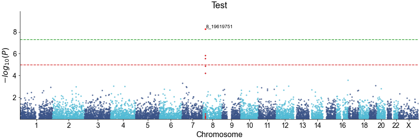
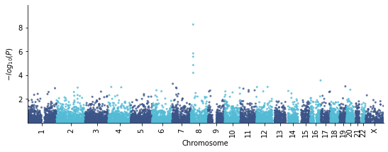
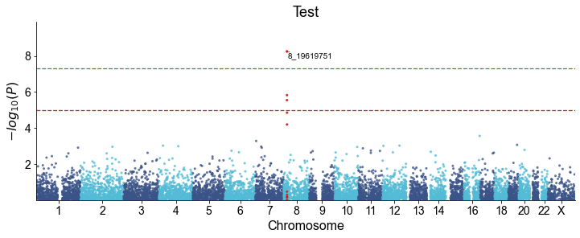

QMplot: A Python tool for creating high-quality manhattan and Q-Q plots from GWAS results.
==========================================================================================

[](https://zenodo.org/badge/latestdoi/340579658)

**qmplot** is a handy, user-friendly tool and Python library that allows
for quick and flexible of publication-ready manhattan and Q-Q plots
directly from PLINK association results files or any data frame with
columns containing chromosomal name, chromosomal position, P-value and
optionally the SNP name(e.g. rsID in dbSNP).

This library is inspired by
[r-qqman](https://github.com/stephenturner/qqman), but it\'s much more
convenient than *r-qqman* that the column of chromosomal name doesn\'t
have to be numeric any more, which means you can **keep the raw name of
chromosomal** and don\'t have to covert X, Y, MT, etc to be 23, 24, 25,
etc.

Dependencies
------------

qmplot supports Python 3.6+ and no longer supports Python 2.

Instatllation requires [numpy](https://numpy.org/),
[scipy](https://www.scipy.org/), [pandas](https://pandas.pydata.org/)
and [matplotlib](https://matplotlib.org/).

Installation
------------

**qmplot** is written by Python and release in PyPI. The latest stable
release can be installed by running the following command:

``` {.bash}
pip install qmplot
```

Quick Start
-----------

We use a PLINK2.x association output data
"[gwas_plink_result.tsv](tests/data/gwas_plink_result.tsv)" which is
in `tests/data` directory, as the input for the plots below. Here is the
format preview of \"gwas_plink_result.tsv\":

  ----------------------------------------------------------------------------------------------------------------
  \#CHROM   POS       ID          REF   ALT   A1   TEST   OBS_CT   BETA         SE         T_STAT      P
  --------- --------- ----------- ----- ----- ---- ------ -------- ------------ ---------- ----------- -----------
  1         904165    1_904165    G     A     A    ADD    282      -0.0908897   0.195476   -0.464967   0.642344

  1         1563691   1_1563691   T     G     G    ADD    271      0.447021     0.422194   1.0588      0.290715

  1         1707740   1_1707740   T     G     G    ADD    283      0.149911     0.161387   0.928888    0.353805

  1         2284195   1_2284195   T     C     C    ADD    275      -0.024704    0.13966    -0.176887   0.859739

  1         2779043   1_2779043   T     C     T    ADD    272      -0.111771    0.139929   -0.79877    0.425182

  1         2944527   1_2944527   G     A     A    ADD    276      -0.054472    0.166038   -0.32807    0.743129

  1         3803755   1_3803755   T     C     T    ADD    283      -0.0392713   0.128528   -0.305547   0.760193

  1         4121584   1_4121584   A     G     G    ADD    279      0.120902     0.127063   0.951511    0.342239

  1         4170048   1_4170048   C     T     T    ADD    280      0.250807     0.143423   1.74873     0.0815274
  ----------------------------------------------------------------------------------------------------------------

**qmplot** apply two ways to generate manhattan and Q-Q plots:

### 1. Commandline options

This is the simplest way to plot manhattan and QQ plots if you already
have PLINK2.x association output. You can directly type `qmplot --help`
and will find all the options below:

```bash
usage: qmplot [-h] -I INPUT -O OUTPREFIX [-T TITLE] [-P SIGN_PVALUE] [-M M_ID]
          [--open-gui]

qmplot: Creates high-quality manhattan and QQ plots from PLINK association
output (or any dataframe with chromosome, position, and p-value).

optional arguments:
  -h, --help            show this help message and exit
  -I INPUT, --input INPUT
                        Input file
  -O OUTPREFIX, --outprefix OUTPREFIX
                        The prefix of output file
  -T TITLE, --title TITLE
                        Title of figure
  -P SIGN_PVALUE, --sign-mark-pvalue SIGN_PVALUE
                        Genome wide significant p-value sites. [1e-6]
  -M M_ID, --top-sign-signal-mark-id M_ID
                        A string denoting the column name for which you want
                        to annotate the Top Significant SNPs. Default: "ID"(PLINK2.x)
  --display             Set to be GUI backend, which can show the figure.
```

The following command will give you the two png plots with 300 dpi
resolution:

```bash
$ qmplot -I data/gwas_plink_result.tsv -T Test -M ID --dpi 300 -O test
```

The manhattan plot looks like:



The Q-Q plot looks like:


Note: You can only modify the plots throught `qmplot` commandline
options which is a big limitation when you want to make more change.

### 2. Python library

This is the most flexible way. You can use qmplot as a library in you
Python code and create the plots by your mind.

### Manhattan plot with default parameters

The `manhattanplot()` function in **qmplot** takes a data frame with
columns containing the chromosomal name/id, chromosomal position,
P-value and optionally the name of SNP(e.g. rsID in dbSNP).

By default, `manhattanplot()` looks for column names corresponding to
those outout by the plink2 association results, namely, "#CHROM",
"POS", "P", and "ID", although different column names can be
specificed by user. Calling `manhattanplot()` function with a data frame
of GWAS results as the single argument draws a basic manhattan plot,
defaulting to a darkblue and lightblue color scheme.

```python
import pandas as pd
import matplotlib.pyplot as plt
from qmplot import manhattanplot

if __name__ == "__main__":

    df = pd.read_table("tests/data/gwas_plink_result.tsv", sep="\t")
    df = df.dropna(how="any", axis=0)  # clean data

    # generate manhattan plot and set an output file.
    ax = manhattanplot(data=df)
    plt.savefig("output_manhattan_plot.png")
```


Rotate the x-axis tick label by setting `xticklabel_kws` to avoid label
overlap:

```python
ax = manhattanplot(data=df,
                   # set vertical or any other degrees as you like.
                   xticklabel_kws={"rotation": "vertical"})
```


Or rotate the labels 45 degrees by setting
`xticklabel_kws={"rotation": 45}`.

When run with default parameters, the `manhattanplot()` function draws
horizontal lines drawn at $-log_{10}{(10^{-5})}$ for "suggestive" 
associations and $-log_{10}{(5×10^{-8})}$ for the "genome-wide significant" 
threshold. These can be move to different locations or turned off completely 
with the arguments `suggestiveline` and `genomewideline`, respectively.

```python
ax = manhattanplot(data=df,
                   suggestiveline=None,  # Turn off suggestiveline
                   genomewideline=None,  # Turn off genomewideline
                   xticklabel_kws={"rotation": "vertical"},
                   is_show=True)  # display the plot in screen
```



The behavior of the `manhattanplot` function changes slightly when
results from only a single chromosome is used. Here, instead of plotting
alternating colors and chromosome ID on the x-axis, the SNP\'s position
on the chromosome is plotted on the x-axis:

```python
# plot only results of chromosome 8.
manhattanplot(data=df, CHR="chr8", xlabel="Chromosome 8")
plt.savefig("output_chr8_manhattan_plot.png")
```


`manhattanplot()` funcion has the ability to highlight SNPs with
significant GWAS signal and annotate the Top SNP, which has the lowest
P-value:

```python
ax = manhattanplot(data=df,
                   sign_marker_p=1e-6,  # highline the significant SNP with ``sign_marker_color`` color.
                   is_annotate_topsnp=True,  # annotate the top SNP
                   xticklabel_kws={"rotation": "vertical"})
```


Additionally, highlighting SNPs of interest can be combined with
limiting to a single chromosome to enable \"zooming\" into a particular
region containing SNPs of interest.

### An example for a better Manhattan plot

Futher graphical parameters can be passed to the `manhattanplot()`
function to control things like plot title, point character, size,
colors, etc. Here is the example:

```python
import pandas as pd
from qmplot import manhattanplot

if __name__ == "__main__":

    # loading data from local file
    df = pd.read_table("tests/data/gwas_plink_result.tsv", sep="\t")
    df = df.dropna(how="any", axis=0)  # clean data

    # defined the plot style
    f, ax = plt.subplots(figsize=(12, 4), facecolor='w', edgecolor='k')
    xtick = set(['chr' + i for i in list(map(str, range(1, 10))) + ['11', '13', '15', '18', '21', 'X']])
    manhattanplot(data=data,
                  marker=".",
                  sign_marker_p=1e-6,  # Genome wide significant p-value
                  sign_marker_color="r",
                  snp="ID",

                  title="Test",
                  xtick_label_set=xtick,
                  xlabel="Chromosome",
                  ylabel=r"$-log_{10}{(P)}$",

                  sign_line_cols=["#D62728", "#2CA02C"],
                  hline_kws={"linestyle": "--", "lw": 1.3},

                  is_annotate_topsnp=True,
                  ld_block_size=500000,  # 500000 bp
                  text_kws={"fontsize": 12,  # The fontsize of annotate text
                            "arrowprops": dict(arrowstyle="-", color="k", alpha=0.6)},
                  ax=ax)
    plt.savefig("better.manhattan.png")
```



Find more details about the parameters by typing `manhattanplot?` in
IPython console.

### QQ plot with defualt parameters

The `qqplot()` function can be used to generate a Q-Q plot to visualize
the distribution of association \"P-value\". The `qqplot()` function
takes a vector of P-values as its the only required argument.

``` {.python}
import pandas as pd
from qmplot import qqplot

if __name__ == "__main__":

    df = pd.read_table("tests/data/gwas_plink_result.tsv", sep="\t")
    df = df.dropna(how="any", axis=0)  # clean data
    ax = qqplot(data=df["P"])
```


### A better QQ plot

Futher graphical parameters can be passed to `qqplot()` to control the
plot title, axis labels, point characters, colors, points sizes, etc.
Here is the example:

``` {.python}
import pandas as pd
import matplotlib.pyplot as plt
from qmplot import qqplot

if __name__ == "__main__":
    df = pd.read_table("tests/data/gwas_plink_result.tsv", sep="\t")
    df = df.dropna(how="any", axis=0)  # clean data

    # Create a Q-Q plot
    f, ax = plt.subplots(figsize=(6, 6), facecolor="w", edgecolor="k")
    qqplot(data=data["P"],
           marker="o",
           title="Test",
           xlabel=r"Expected $-log_{10}{(P)}$",
           ylabel=r"Observed $-log_{10}{(P)}$",
           ax=ax)

    plt.savefig("test.QQ.png")
```


Find more details about the parameters by typing `qqplot?` in IPython
console.
