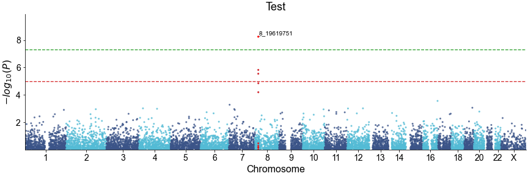
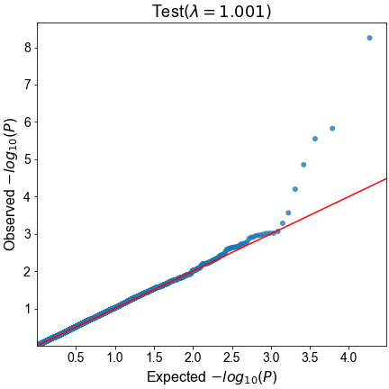
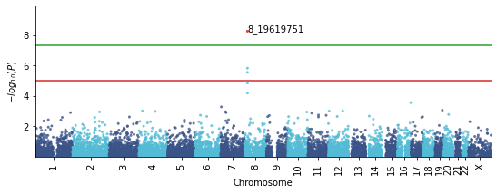

QMplot: A Python tool for creating high-quality manhattan and Q-Q plots from GWAS results.
==========================================================================================

.. image:: https://zenodo.org/badge/340579658.svg
   :target: https://zenodo.org/badge/latestdoi/340579658

**qmplot** is a handy, user-friendly tool and Python library that allows for quick and 
flexible of publication-ready manhattan and Q-Q plots directly from PLINK association 
results files or any data frame with columns containing chromosomal name, chromosomal 
position, P-value and optionally the SNP name(e.g. rsID in dbSNP).

This library is inspired by
`r-qqman <https://github.com/stephenturner/qqman>`__, but it's much more convenient than *r-qqman* 
that the column of chromosomal name doesn't have to be numeric any more, which means you can **keep 
the raw name of chromosomal** and don't have to covert X, Y, MT, etc to be 23, 24, 25, etc.

Dependencies
------------

qmplot supports Python 3.6+ and no longer supports Python 2.

Instatllation requires `numpy <https://numpy.org/>`__,
`scipy <https://www.scipy.org/>`__,
`pandas <https://pandas.pydata.org/>`__ and
`matplotlib <https://matplotlib.org/>`__.

Installation
------------

**qmplot** is written by Python and release in PyPI. The latest stable
release can be installed by running the following command:

.. code:: bash
        
        pip install qmplot

Quick Start
-----------

We use a PLINK2.x association output data
"`gwas_plink_result.tsv <tests/data/gwas_plink_result.tsv>`__\ " which
is in ``tests/data`` directory, as the input for the plots below. Here
is the format preview of "gwas\_plink\_result.tsv":

+----------+-----------+--------------+-------+-------+------+--------+-----------+--------------+------------+-------------+-------------+
| #CHROM   | POS       | ID           | REF   | ALT   | A1   | TEST   | OBS\_CT   | BETA         | SE         | T\_STAT     | P           |
+==========+===========+==============+=======+=======+======+========+===========+==============+============+=============+=============+
| 1        | 904165    | 1\_904165    | G     | A     | A    | ADD    | 282       | -0.0908897   | 0.195476   | -0.464967   | 0.642344    |
+----------+-----------+--------------+-------+-------+------+--------+-----------+--------------+------------+-------------+-------------+
| 1        | 1563691   | 1\_1563691   | T     | G     | G    | ADD    | 271       | 0.447021     | 0.422194   | 1.0588      | 0.290715    |
+----------+-----------+--------------+-------+-------+------+--------+-----------+--------------+------------+-------------+-------------+
| 1        | 1707740   | 1\_1707740   | T     | G     | G    | ADD    | 283       | 0.149911     | 0.161387   | 0.928888    | 0.353805    |
+----------+-----------+--------------+-------+-------+------+--------+-----------+--------------+------------+-------------+-------------+
| 1        | 2284195   | 1\_2284195   | T     | C     | C    | ADD    | 275       | -0.024704    | 0.13966    | -0.176887   | 0.859739    |
+----------+-----------+--------------+-------+-------+------+--------+-----------+--------------+------------+-------------+-------------+
| 1        | 2779043   | 1\_2779043   | T     | C     | T    | ADD    | 272       | -0.111771    | 0.139929   | -0.79877    | 0.425182    |
+----------+-----------+--------------+-------+-------+------+--------+-----------+--------------+------------+-------------+-------------+
| 1        | 2944527   | 1\_2944527   | G     | A     | A    | ADD    | 276       | -0.054472    | 0.166038   | -0.32807    | 0.743129    |
+----------+-----------+--------------+-------+-------+------+--------+-----------+--------------+------------+-------------+-------------+
| 1        | 3803755   | 1\_3803755   | T     | C     | T    | ADD    | 283       | -0.0392713   | 0.128528   | -0.305547   | 0.760193    |
+----------+-----------+--------------+-------+-------+------+--------+-----------+--------------+------------+-------------+-------------+
| 1        | 4121584   | 1\_4121584   | A     | G     | G    | ADD    | 279       | 0.120902     | 0.127063   | 0.951511    | 0.342239    |
+----------+-----------+--------------+-------+-------+------+--------+-----------+--------------+------------+-------------+-------------+
| 1        | 4170048   | 1\_4170048   | C     | T     | T    | ADD    | 280       | 0.250807     | 0.143423   | 1.74873     | 0.0815274   |
+----------+-----------+--------------+-------+-------+------+--------+-----------+--------------+------------+-------------+-------------+

**qmplot** apply two ways to generate manhattan and Q-Q plots:

1. Commandline options
~~~~~~~~~~~~~~~~~~~~~~

This is the simplest way to plot manhattan and QQ plots if you already
have PLINK2.x association output. You can directly type ``qmplot --help`` 
and will find all the options below:

.. code:: bash

        usage: qmplot [-h] -I INPUT -O OUTPREFIX [-T TITLE] [-P SIGN_PVALUE] [-M M_ID]
                  [--open-gui]

        qmplot: Creates high-quality manhattan and QQ plots from PLINK association
        output (or any dataframe with chromosome, position, and p-value).

        optional arguments:
          -h, --help            show this help message and exit
          -I INPUT, --input INPUT
                                Input file
          -O OUTPREFIX, --outprefix OUTPREFIX
                                The prefix of output file
          -T TITLE, --title TITLE
                                Title of figure
          -P SIGN_PVALUE, --sign-mark-pvalue SIGN_PVALUE
                                Genome wide significant p-value sites. [1e-6]
          -M M_ID, --top-sign-signal-mark-id M_ID
                                A string denoting the column name for which you want
                                to annotate the Top Significant SNPs. Default: "ID"(PLINK2.x)
          --display             Set to be GUI backend, which can show the figure.

The following command will give you the two png plots with 300 dpi
resolution:

.. code:: bash

        $ qmplot -I data/gwas_plink_result.tsv -T Test -M ID --dpi 300 -O test

The manhattan plot looks like:

The Q-Q plot looks like:

Note: You can only modify the plots throught ``qmplot`` commandline
options which is a big limitation when you want to make more change.

2. Python library
~~~~~~~~~~~~~~~~~

This is the most flexible way. You can use qmplot as a library in you
Python code and create the plots by your mind.

Manhattan plot with default parameters
~~~~~~~~~~~~~~~~~~~~~~~~~~~~~~~~~~~~~~

The ``manhattanplot()`` function in **qmplot** takes a data frame with 
columns containing the chromosomal name/id, chromosomal position, P-value 
and optionally the name of SNP(e.g. rsID in dbSNP). 

By default, ``manhattanplot()`` looks for column names corresponding to 
those outout by the plink2 association results, namely, "#CHROM", "POS",
"P", and "ID", although different column names can be specificed by user.
Calling ``manhattanplot()`` function with a data frame of GWAS results as 
the single argument draws a basic manhattan plot, defaulting to a darkblue
and lightblue color scheme.

.. code:: python

    import pandas as pd
    from qmplot import manhattanplot

    if __name__ == "__main__":

        df = pd.read_table("tests/data/gwas_plink_result.tsv", sep="\t")
        df = df.dropna(how="any", axis=0)  # clean data

        # generate manhattan plot and set an output file.
        ax = manhattanplot(data=df, figname="output_manhattan_plot.png")

.. figure:: tests/output_manhattan_plot.png
   :alt: output\_manhattan\_plot.png

Rotate the x-axis tick label by setting ``xticklabel_kws`` to avoid label overlap:

.. code:: python

    ax = manhattanplot(data=df,
                       xticklabel_kws={"rotation": "vertical"},  # set vertical or any other degrees as you like.
                       figname="output_manhattan_plot.png")

.. figure:: tests/output_manhattan_plot_xviertical.png

Or rotate the labels 45 degrees by setting ``xticklabel_kws={"rotation": 45}``.

The parameters of ``manhattanplot()`` defined the name of output figure file 
and the format of the figure file depending on the file suffix, which could
be ".png", ".jpg", or ".pdf".

When run with default parameters, the ``manhattanplot()`` function draws 
horizontal lines drawn at $-log_{10}{(1e-5)}$ for "suggestive" associations 
and $-log_{10}{(5e-8)}$ for the "genome-wide significant" threshold. These 
can be move to different locations or turned off completely with the arguments 
``suggestiveline`` and ``genomewideline``, respectively.

.. code:: python

    ax = manhattanplot(data=df,
                       suggestiveline=None,  # Turn off suggestiveline
                       genomewideline=None,  # Turn off genomewideline
                       xticklabel_kws={"rotation": "vertical"},
                       is_show=True,  # display the plot in screen
                       figname="output_manhattan_plot.png")

.. figure:: tests/output_manhattan_plot_xviertical_noline.png

The behavior of the ``manhattanplot`` function changes slightly when results 
from only a single chromosome is used. Here, instead of plotting alternating
colors and chromosome ID on the x-axis, the SNP's position on the chromosome 
is plotted on the x-axis:

.. code:: python

    # plot only results of chromosome 8.
    manhattanplot(data=df, CHR="chr8", xlabel="Chromosome 8",
                  figname="output_chr8_manhattan_plot.png")

.. figure:: tests/output_chr8_manhattan_plot.png

``manhattanplot()`` funcion has the ability to highlight SNPs with significant 
GWAS signal and annotate the Top SNP, which has the lowest P-value:

.. code:: python

    ax = manhattanplot(data=df,
                       sign_marker_p=1e-6,  # highline the significant SNP with ``sign_marker_color`` color.
                       is_annotate_topsnp=True,  # annotate the top SNP
                       xticklabel_kws={"rotation": "vertical"},
                       figname="output_manhattan_anno_plot.png")

Additionally, highlighting SNPs of interest can be combined with limiting to a
single chromosome to enable "zooming" into a particular region containing SNPs 
of interest.

An example for a better Manhattan plot
~~~~~~~~~~~~~~~~~~~~~~~~~~~~~~~~~~~~~~

Futher graphical parameters can be passed to the ``manhattanplot()`` function 
to control things like plot title, point character, size, colors, etc. Here is 
the example:

.. code:: python

    import pandas as pd
    from qmplot import manhattanplot

    if __name__ == "__main__":

        # loading data from local file
        df = pd.read_table("tests/data/gwas_plink_result.tsv", sep="\t")
        df = df.dropna(how="any", axis=0)  # clean data

        # defined the plot style
        f, ax = plt.subplots(figsize=(12, 4), facecolor='w', edgecolor='k')
        xtick = set(['chr' + i for i in list(map(str, range(1, 10))) + ['11', '13', '15', '18', '21', 'X']])
        manhattanplot(data=data,
                      marker=".",
                      sign_marker_p=1e-6,  # Genome wide significant p-value
                      sign_marker_color="r",
                      snp="ID",

                      title="Test",
                      xtick_label_set=xtick,
                      xlabel="Chromosome",
                      ylabel=r"$-log_{10}{(P)}$",

                      sign_line_cols=["#D62728", "#2CA02C"],
                      hline_kws={"linestyle": "--", "lw": 1.3},

                      is_annotate_topsnp=True,
                      ld_block_size=500000,  # 500000 bp
                      text_kws={"fontsize": 12,  # The fontsize of annotate text
                                "arrowprops": dict(arrowstyle="-", color="k", alpha=0.6)},
                      dpi=300,
                      figname="output_manhattan_plot.png",
                      ax=ax)

Find more details about the parameters by typing ``manhattanplot?`` in IPython console.

QQ plot with defualt parameters
~~~~~~~~~~~~~~~~~~~~~~~~~~~~~~~

The ``qqplot()`` function can be used to generate a Q-Q plot to visualize the distribution of association "P-value".
The ``qqplot()`` function takes a vector of P-values as its the only required argument.

.. code:: python

        import pandas as pd
        from qmplot import qqplot

        if __name__ == "__main__":

            df = pd.read_table("tests/data/gwas_plink_result.tsv", sep="\t")
            df = df.dropna(how="any", axis=0)  # clean data
            ax = qqplot(data=df["P"], figname="output_QQ_plot.png")

.. figure:: tests/output_QQ_plot.png

A better QQ plot
~~~~~~~~~~~~~~~~

Futher graphical parameters can be passed to ``qqplot()`` to control the plot title, axis labels, point 
characters, colors, points sizes, etc. Here is the example:

.. code:: python

        import pandas as pd
        from qmplot import qqplot

        if __name__ == "__main__":

            df = pd.read_table("tests/data/gwas_plink_result.tsv", sep="\t")
            df = df.dropna(how="any", axis=0)  # clean data
            # Create a Q-Q plot
            f, ax = plt.subplots(figsize=(6, 6), facecolor="w", edgecolor="k")
            qqplot(data=data["P"],
                   marker="o",
                   title="Test",
                   xlabel=r"Expected $-log_{10}{(P)}$",
                   ylabel=r"Observed $-log_{10}{(P)}$",
                   dpi=300,
                   figname="output_QQ_plot.png",
                   ax=ax)

Find more details about the parameters by typing ``qqplot?`` in IPython console.

